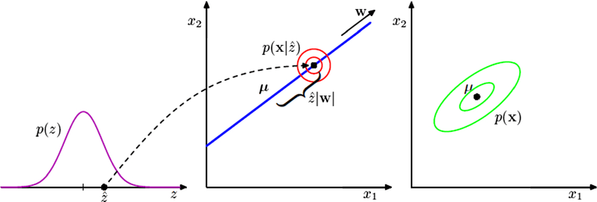

# probability-pca-implementation
 Implementation of PPCA on numeric dataset, and test the extrapolation and reconstruction result on RF classifier model

## pre requisite
ppca_rs --> https://pypi.org/project/ppca-rs/

sklearn --> https://scikit-learn.org/stable/install.html

## PPCA 

